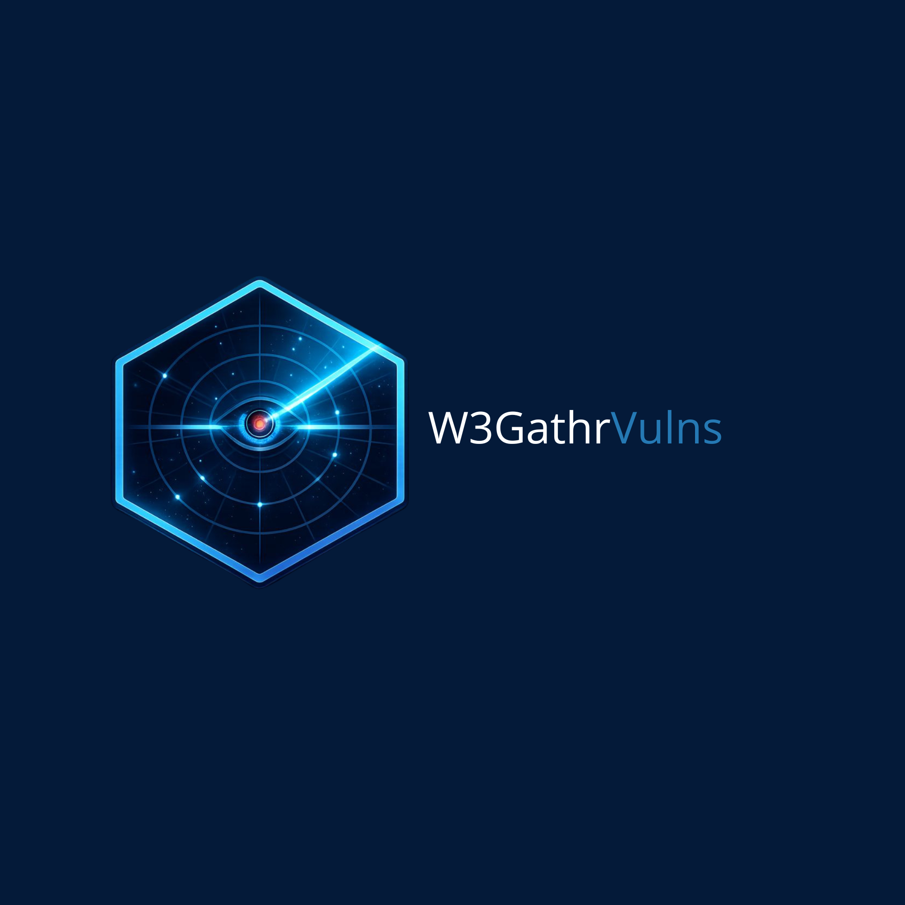

<p align="center">
  
</p>

<p align="center">
  
  
  
  
  
</p>

---

Hi there,

I needed a tool to centralise vulnerability findings from my CI/CD pipelines. I looked at what existed in open source and didn't find anything that matched what I had in mind, so I decided to build it myself. It was also the perfect occasion to try [Claude Code](https://claude.ai/code) — with its help, I built in two weeks what would have taken me twice as long on my own. Sharing it here for anyone who might find it useful.

W3GathrVulns is shared with the community as-is. It will evolve on a best-effort basis without any guarantee of professional maintenance. That being said, I would be genuinely happy to see it reviewed, improved, and extended by others. Contributions, bug reports, and ideas are very welcome — see [CONTRIBUTING.md](docs/CONTRIBUTING.md).

> **v0.1.0-beta** — Core features functional and ready for testing. See the roadmap for upcoming capabilities.

> **Live demo** — [demo.w3gathrvulns.com](https://demo.w3gathrvulns.com). Login: `admin` / `W3Gathr!Demo`. Data resets every hour.

---

## What it does

W3GathrVulns is a self-hosted security findings management platform built with FastAPI + React + PostgreSQL.

It centralises vulnerability reports from your CI/CD pipelines into a single dashboard: deduplicated, filterable, and exportable.

- **Multi-scanner ingestion** — Trivy, GitLab SAST/IaC/Secrets, OWASP ZAP, Nuclei
- **Smart deduplication** — findings deduplicated across scans per project
- **Dashboard** — 3-row KPIs, 30-day trend, status/severity donuts, stacked severity×project chart
- **Finding management** — status, severity, notes, false positives
- **Auto-triage rules engine** — condition/action rules with regex support and built-in cron scheduling
- **Authentication** — web UI login + read/write API tokens for CI/CD pipelines
- **Export** — CSV and PDF reports respecting active filters
- **Light/Dark theme** — toggle in the sidebar
- **Swagger API** — full interactive API docs at `/api/docs`

---

## Documentation

- [ARCHITECTURE.md](docs/ARCHITECTURE.md) — Technical architecture, data model, component breakdown
- [OPERATIONS.md](docs/OPERATIONS.md) — Installation, configuration, scanner integration, backup/restore
- [FORMATION.md](docs/FORMATION.md) — In-depth code training guide
- [CONTRIBUTING.md](docs/CONTRIBUTING.md) — How to contribute

---

## Tech Stack

| Layer | Technology |
|---|---|
| Backend | FastAPI 0.111 + SQLAlchemy 2.0 |
| Database | PostgreSQL 16 |
| Scheduler | APScheduler 3.10 |
| Auth | python-jose (JWT) |
| Frontend | React 19 + Vite + Recharts |
| Proxy | Nginx (HTTPS + TLS termination) |
| Deploy | Docker Compose |

---

## Quick Start

```bash
git clone <repo-url>
cd w3gathrvulns/tool

# Generate .env with secure secrets (interactive)
bash setup.sh

# Start the stack
docker compose up -d --build
```

`setup.sh` will prompt for:
- **Server IP / hostname** — used for TLS certificate and CORS
- **Admin password** — for the web UI login

After startup (~1–2 min), open `https://<SERVER_IP>` and log in with `admin` / the password you chose.

> **Self-signed certificate** — your browser will show a security warning on first visit. This is expected: the stack generates its own TLS certificate. Click **Advanced → Proceed** (Chrome) or **Accept the Risk** (Firefox) to continue. To remove the warning, replace the certificate with one from a trusted CA.

See [OPERATIONS.md](docs/OPERATIONS.md) for the full guide (installation, scanner integration, backup/restore) and [ARCHITECTURE.md](docs/ARCHITECTURE.md) for the technical overview.

---

## Authentication

### Web UI
Browse to `https://<SERVER_IP>` → login page. Credentials are set during `setup.sh`.

### API (CI/CD integrations)

Every API request requires a `Bearer` token:

| Token | Variable in `.env` | Access |
|---|---|---|
| Read token | `API_TOKEN_READ` | GET only |
| Write token | `API_TOKEN_WRITE` | Full access (ingest, mutations) |

Generated automatically by `setup.sh`, printed to the terminal, and stored in the DB. Tokens can be regenerated at any time from the Settings page.

---

## Sending Scan Results

See **[OPERATIONS.md — Integrating Scanners](docs/OPERATIONS.md#integrating-scanners)** for full examples (Trivy, GitLab CI, OWASP ZAP, Nuclei, curl snippets).

All ingest endpoints accept `Authorization: Bearer $API_TOKEN_WRITE`.

---

## Running Tests

```bash
cd tool/backend
pip install -r requirements-test.txt
pytest
```

Tests use an in-memory SQLite database — no PostgreSQL required.

---

## Roadmap

| Priority | Feature | Status |
|---|---|---|
| 1 | **Notifications** — Slack/Teams/email webhooks on new CRITICAL findings | Planned |
| 2 | **Multi-user & roles** — per-user accounts, admin/analyst/read-only RBAC | Planned |
| 3 | **SLA tracking** — configurable deadlines per severity, overdue alerts | Planned |
| 4 | **Finding comments** — threaded collaboration, activity feed | Planned |
| 5 | **More scanners** — Grype, Semgrep OSS, Checkov, Dependabot, GitHub Advanced Security | Planned |
| 6 | **GitHub/GitLab integration** — auto-create issues from findings, status sync | Planned |
| 7 | **Finding enrichment** — EPSS, CISA KEV cross-reference, VEX | Planned |
| 8 | **Compliance reports** — MTTR, risk score, ISO 27001 / SOC2 templates | Planned |
| 9 | **Multi-tenancy** — organisation-level isolation, audit log | Planned |
| 10 | **Full backup / restore** — export and reimport the complete instance state (findings, rules, settings) as a single file from the Settings page | Planned |

---

## License

MIT — see [LICENSE](LICENSE) file.

---

## Contributing

W3GathrVulns is built for the security community. Contributions, bug reports, and feature requests are welcome — see [CONTRIBUTING.md](docs/CONTRIBUTING.md).

---

## Acknowledgements

- **[Creative Tim](https://creative-tim.com)** — the frontend design is based on the [Purity UI Dashboard](https://demos.creative-tim.com/purity-ui-dashboard/#/admin/dashboard) React template.
- **Logo** — Thanks to A***** B**** who created the logo.
- **Beta testers** — thank you to everyone who tested the tool before the first release and shared feedback.

---

## Contact

You can reach me at **inimzil.pro@gmail.com** or learn more about me at [nimzil.fr](https://nimzil.fr).
